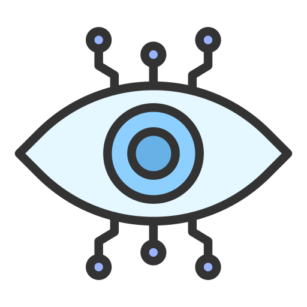

<!-- PROJECT LOGO -->
 

  

<h3 align="center">Computer Vision Projects repository</h3>

Welcome to this repository, a collection of diverse computer vision projects aimed at solving real-world challenges through innovative techniques. Whether you're exploring object detection, image segmentation, face recognition, or feature extraction, this repository provides hands-on examples to help you understand and implement various algorithms in the field of computer vision.
Each project is designed with a clear purpose, demonstrating applications of cutting-edge technologies like convolutional neural networks (CNNs), image processing, and machine learning. You'll find detailed documentation, code examples, and explanations to help you get started, whether you're a beginner or a seasoned professional.
Feel free to explore, clone, and contribute to any of the projects. Let's push the boundaries of what computer vision can achieve!

### Built With

* [![Python][Python]][Python-url]
* [![OpenCV][OpenCV]][OpenCV-url]
* [![NumPy][NumPy]][NumPy-url]
* [![Pandas][Pandas]][Pandas-url]
* [![Pytorch][Pytorch]][Pytorch-url]
* [![Scikit-learn][Scikit-learn]][Scikit-learn-url]
* [![Ultralytics][Ultralytics]][Ultralytics-url]
* [![Tkinter][Tkinter]][Tkinter-url]

(<a href="#readme-top">back to top</a>)

<!-- GETTING STARTED -->
## Getting Started

Each folder in this repository contains its own README with detailed instructions on how to clone, run, and understand the project.

## Projects

<table><thead>
  <tr>
    <th>Project Name</th>
    <th>Description</th>
  </tr></thead>
<tbody>
  <tr>
    <td>Drone Segmentation</td>
    <td>Aereal Drone Image Segmentation through U-net architecture</td>
  </tr>
  <tr>
    <td>Heatmap Video Analysis</td>
    <td>Heatmap Video Analysis through Object Detection</td>
  </tr>
  <tr>
    <td>Face Attendance App</td>
    <td>Face Attendance App using Mediapipe and Face Recognition</td>
  </tr>
  <tr>
    <td>Mediapipe Labyrinth</td>
    <td>An AI hand-controlled labyrinth game</td>
  </tr>
  <tr>
    <td>Road Lane Detector</td>
    <td>Road Lane Detector for Autonomous Vehicles</td>
  </tr>
  <tr>
    <td>Rock - Paper - Scissor</td>
    <td>Rock, Paper and Scissor detection using a webcam and Support Vector Machine (SVM) algorithm</td>
  </tr>
  <tr>
    <td>Surveillance Camera System</td>
    <td>Surveillance camera system that detects people and send an email to advise you</td>
  </tr>
  <tr>
    <td>Vehicle Speed Estimation</td>
    <td>Vehicle speed estimation using a highway camera, Ultralytics-YOLOv8 and image processing techniques</td>
  </tr>
  <tr>
    <td>VisDrone</td>
    <td>Computer Vision using the VisDrone dataset: Detection and tracking in images and videos</td>
  </tr>
</tbody></table>

<!-- CONTACT -->
## Contact
Any comment or contribution is welcome and I will be attentive to respond to you :)

Nicolás Salomón - [Linkedin](https://www.linkedin.com/in/nicolassalomon96/) - [Gmail](nicolassalomon96@gmail.com)

(<a href="#readme-top">back to top</a>)

<!-- MARKDOWN LINKS & IMAGES -->
<!-- https://www.markdownguide.org/basic-syntax/#reference-style-links -->
[product-screenshot]: images/Readme/output_test_1.png
[Python]: https://img.shields.io/badge/python-3670A0?style=for-the-badge&logo=python&logoColor=ffdd54
[Python-url]: https://www.python.org/
[OpenCV]: https://img.shields.io/badge/OpenCV-27338e?style=for-the-badge&logo=OpenCV&logoColor=white
[OpenCV-url]: https://opencv.org/
[NumPy]: https://img.shields.io/badge/-NumPy-013243?style=flat&logo=numpy&logoColor=white
[NumPy-url]: https://numpy.org/
[MediaPipe]: images/Readme/mediapipe_logo.png
[MediaPipe-url]: https://mediapipe-studio.webapps.google.com/home
[Tkinter]: https://img.shields.io/badge/Made_with-tkinter-blue?style=for-the-badge
[Tkinter-url]: https://docs.python.org/es/3/library/tkinter.html
[Pytorch]: https://img.shields.io/badge/PyTorch-black?logo=PyTorch
[Pytorch-url]: https://pytorch.org/
[Pandas]: https://img.shields.io/badge/-pandas-05122A?style=flat&logo=pandas
[Pandas-url]: https://pandas.pydata.org/
[Scikit-learn]: https://img.shields.io/badge/scikit-learn-whitesmoke?style=for-the-badge&logo=scikit-learn
[Scikit-learn-url]: https://scikit-learn.org/
[Ultralytics]: https://img.shields.io/badge/ultralytics-v8.1.0-blue
[Ultralytics-url]: https://docs.ultralytics.com/
