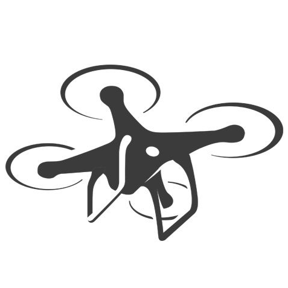

<!-- PROJECT LOGO -->
<br />
<div align="center">
  <a href="https://github.com/nicolassalomon96/CV_projects/tree/main/drone_segmentation">
    
  </a>

<h3 align="center">Aereal Drone Image Segmentation through U-net architecture</h3>

  <p align="center">
    Drone Image Segmentation using a custom U-net architecture and a pretrained model that levarage fine-tuning models advantages.
    <br />
    <a href="https://github.com/nicolassalomon96/CV_projects/tree/main/drone_segmentation"><strong>Explore the docs »</strong></a>
    <br />
    <br />
    <a href="https://github.com/nicolassalomon96/CV_projects/tree/main/drone_segmentation/images/output_test.png">View Demo</a>
    ·
    <a href="https://github.com/nicolassalomon96/CV_projects/tree/main/drone_segmentation/issues/new?labels=bug&template=bug-report---.md">Report Bug</a>
    ·
    <a href="https://github.com/nicolassalomon96/CV_projects/tree/main/drone_segmentation/issues/new?labels=enhancement&template=feature-request---.md">Request Feature</a>
  </p>
</div>


<!-- TABLE OF CONTENTS -->
<details>
  <summary>Table of Contents</summary>
  <ol>
    <li>
      <a href="#about-the-project">About The Project</a>
      <ul>
        <li><a href="#built-with">Built With</a></li>
      </ul>
    </li>
    <li>
      <a href="#getting-started">Getting Started</a>
      <ul>
        <li><a href="#prerequisites">Prerequisites</a></li>
        <li><a href="#installation">Installation</a></li>
      </ul>
    </li>
    <li><a href="#usage">Usage</a></li>
    <li><a href="#contact">Contact</a></li>
  </ol>
</details>


<!-- ABOUT THE PROJECT -->
## About The Project

![Product Name Screen Shot][product-screenshot]

* Project Summary and Importance

This project focuses on the segmentation of aerial images captured by drones using the Unet architecture, a convolutional neural network designed for image segmentation tasks. Two different approaches were implemented and compared: one using a Unet architecture trained from scratch and the other using a pre-trained Unet architecture.

Accurate segmentation of drone images has a wide range of applications in various fields, including precision agriculture, environmental monitoring, disaster management, and urban planning. In this project, we specifically focused on the segmentation of 23 different zones or objects, as well as determining suitable and unsuitable zones for drone landing. The ability to identify these zones with high precision is crucial for ensuring the safety and efficiency of drone operations.

* Architecture and Methods

Unet Trained from Scratch: A Unet architecture was developed from the ground up, training it with a specific dataset for the segmentation task. This approach allowed the network to be tailored specifically to the characteristics of the dataset.

Pre-trained Unet: A pre-trained Unet architecture on large generic datasets was used, which was then fine-tuned with the specific dataset for drone landing zone segmentation. This approach leveraged the already learned features of the network, reducing training time and improving the accuracy of the results.

* Results and Conclusions

The results showed that the pre-trained Unet significantly outperformed the Unet trained from scratch in terms of accuracy and convergence time. Transfer learning allowed the pre-trained network to capture relevant features more efficiently, resulting in more precise segmentation.

* Future Applications

The techniques developed in this project have great potential to be applied in various areas. In agriculture, they can help identify specific crop areas that require attention. In environmental monitoring, they can be used to track landscape changes or detect areas affected by natural disasters. Additionally, in disaster management, they can help plan safer and more effective rescue operations.

In summary, this project demonstrates the value of using advanced neural network architectures, such as Unet, in drone image segmentation, highlighting especially the benefits of using pre-trained networks to improve results and process efficiency.

<p align="right">(<a href="#readme-top">back to top</a>)</p>


### Built With

* [![Python][Python]][Python-url]
* [![OpenCV][OpenCV]][OpenCV-url]
* [![NumPy][NumPy]][NumPy-url]
* [![Pytorch][Pytorch]][Pytorch-url]

<p align="right">(<a href="#readme-top">back to top</a>)</p>


<!-- GETTING STARTED -->
## Getting Started

This is an example of how you may set up this project locally in your computer.
To get a local copy up and running follow these simple example steps.

### Prerequisites

The following packages may be installed in order to run the code:
* Numpy, SMP (segmentation_models_pytorch), Opencv, Pillow, Matplotlib.
  ```sh
  pip install numpy segmentation-models-pytorch opencv-python pillow matplotlib
  ```

### Installation

1. Clone the repo
   ```sh
   git clone https://github.com/nicolassalomon96/CV_projects/tree/main/drone_segmentation
   ```
2. Install required packages listed on Prerequisites

<p align="right">(<a href="#readme-top">back to top</a>)</p>


<!-- USAGE EXAMPLES -->
## Usage

This project has three different Notebooks according to the trained net. All of these nets were trained using Aerial Semantic Segmentation Drone Dataset (https://www.kaggle.com/datasets/bulentsiyah/semantic-drone-dataset). This dataset is composed of 400 aerial images captured by drones, segmented into 23 different classes according to the following image:

<div align="center">
  <a href="https://github.com/nicolassalomon96/CV_projects/tree/main/drone_segmentation/images/classes.png">
    
  </a>
</div>

1. drone_seg.ipynb shows you the preprocess, training and results of a custom U-net architecture. The trained network shows an IoU = 0.0982 and an Accuracy = 0.5797 on the Validation Dataset. This result is not bad but it could be improved.

2. Looking for better results a pretrained model was used in order to be trained with our custom dataset. Results are shown in drone_seg_smp.ipynb Notebook, where the python package SMP (segmentation-models-pytorch) was used to define the pretrained U-net architecture. The trained network shows an IoU = 0.2405 and an Accuracy = 0.9859 on the Validation Dataset. This result greatly improves performance compared to the network trained from 0, demonstrating the great advantage of using fine-tuning in the training of neural networks.

3. Additionally, a model was trained that groups the 23 classes into 5 different classes for segmentation, according to the image bellow.

<div align="center">
  <a href="https://github.com/nicolassalomon96/CV_projects/tree/main/drone_segmentation/images/classes_5.png">
    
  </a>
</div>

3. Finally, a model for only detecting landable areas was trained using the same dataset. Training results are available on drone_seg_smp_landable.ipynb Notebook.

<div align="center">
  <a href="https://github.com/nicolassalomon96/CV_projects/tree/main/drone_segmentation/images/landable_zones.png">
    
  </a>
</div>

<p align="right">(<a href="#readme-top">back to top</a>)</p>


<!-- ROADMAP -->
<!--
## Roadmap

- [ ] Feature 1
- [ ] Feature 2
- [ ] Feature 3
    - [ ] Nested Feature

See the [open issues](https://github.com/github_username/repo_name/issues) for a full list of proposed features (and known issues).

<p align="right">(<a href="#readme-top">back to top</a>)</p>
-->

<!-- CONTRIBUTING -->
<!--
## Contributing

Contributions are what make the open source community such an amazing place to learn, inspire, and create. Any contributions you make are **greatly appreciated**.

If you have a suggestion that would make this better, please fork the repo and create a pull request. You can also simply open an issue with the tag "enhancement".
Don't forget to give the project a star! Thanks again!

1. Fork the Project
2. Create your Feature Branch (`git checkout -b feature/AmazingFeature`)
3. Commit your Changes (`git commit -m 'Add some AmazingFeature'`)
4. Push to the Branch (`git push origin feature/AmazingFeature`)
5. Open a Pull Request

<p align="right">(<a href="#readme-top">back to top</a>)</p>
-->


<!-- LICENSE -->
<!--
## License

Distributed under the MIT License. See `LICENSE.txt` for more information.

<p align="right">(<a href="#readme-top">back to top</a>)</p>
-->


<!-- CONTACT -->
## Contact
Any comment or contribution is welcome and I will be attentive to respond to you :)

Nicolás Salomón - [Linkedin](https://www.linkedin.com/in/nicolassalomon96/) - [Gmail](nicolassalomon96@gmail.com)

Project Link: [https://github.com/nicolassalomon96/CV_projects/tree/main/drone_segmentation](https://github.com/nicolassalomon96/CV_projects/tree/main/drone_segmentation)

<p align="right">(<a href="#readme-top">back to top</a>)</p>


<!-- MARKDOWN LINKS & IMAGES -->
<!-- https://www.markdownguide.org/basic-syntax/#reference-style-links -->
[product-screenshot]: images/output_test_1.png
[Python]: https://img.shields.io/badge/python-3670A0?style=for-the-badge&logo=python&logoColor=ffdd54
[Python-url]: https://www.python.org/
[OpenCV]: https://img.shields.io/badge/OpenCV-27338e?style=for-the-badge&logo=OpenCV&logoColor=white
[OpenCV-url]: https://opencv.org/
[NumPy]: https://img.shields.io/badge/-NumPy-013243?style=flat&logo=numpy&logoColor=white
[NumPy-url]: https://numpy.org/
[Pytorch]: https://img.shields.io/badge/PyTorch-black?logo=PyTorch
[Pytorch-url]: https://pytorch.org/