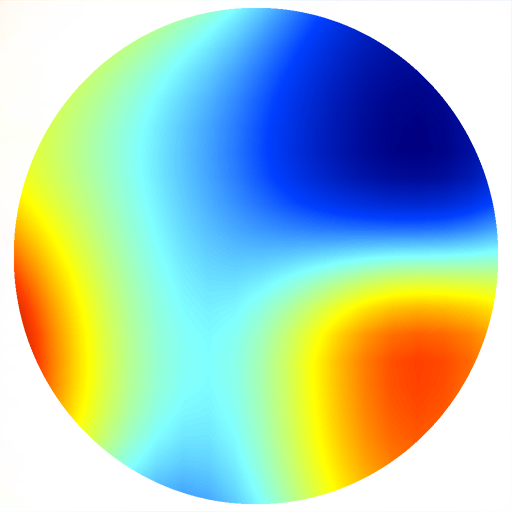
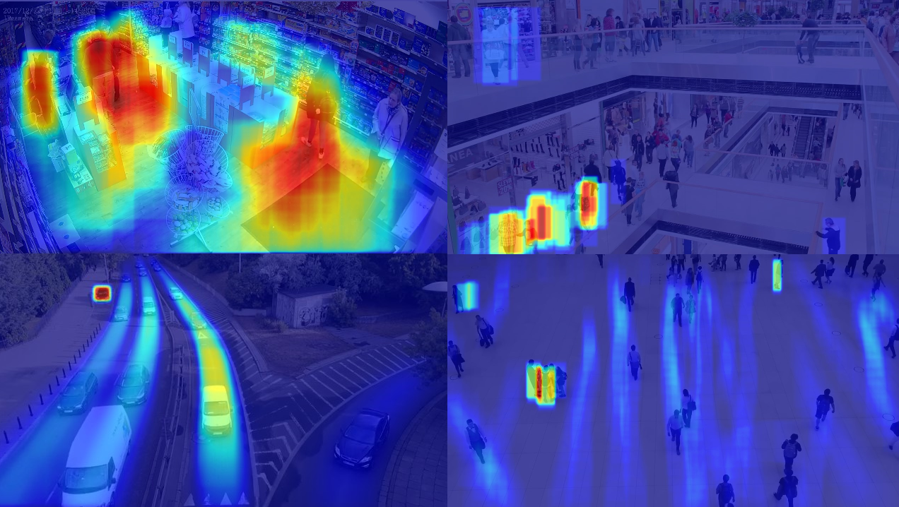

<!-- PROJECT LOGO -->
<br />
<div align="center">
  <a href="https://github.com/nicolassalomon96/CV_projects/tree/main/heatmap_video_analysis">
    
  </a>

<h3 align="center">Heatmap Video Analysis through Object Detection</h3>

  <p align="center">
    Useful Heatmap Video Analysis to extract areas where objects stay most of the time. It allows you to measure statics objects and in movement as well.
    <br />
    <a href="https://github.com/nicolassalomon96/CV_projects/tree/main/heatmap_video_analysis"><strong>Explore the docs »</strong></a>
    <br />
    <br />
    <a href="https://github.com/nicolassalomon96/CV_projects/tree/main/heatmap_video_analysis/images/Readme/outputs.png">View Demo</a>
    ·
    <a href="https://github.com/nicolassalomon96/CV_projects/tree/main/heatmap_video_analysis/issues/new?labels=bug&template=bug-report---.md">Report Bug</a>
    ·
    <a href="https://github.com/nicolassalomon96/CV_projects/tree/main/heatmap_video_analysis/issues/new?labels=enhancement&template=feature-request---.md">Request Feature</a>
  </p>
</div>


<!-- TABLE OF CONTENTS -->
<details>
  <summary>Table of Contents</summary>
  <ol>
    <li>
      <a href="#about-the-project">About The Project</a>
      <ul>
        <li><a href="#built-with">Built With</a></li>
      </ul>
    </li>
    <li>
      <a href="#getting-started">Getting Started</a>
      <ul>
        <li><a href="#prerequisites">Prerequisites</a></li>
        <li><a href="#installation">Installation</a></li>
      </ul>
    </li>
    <li><a href="#usage">Usage</a></li>
    <li><a href="#contact">Contact</a></li>
  </ol>
</details>


<!-- ABOUT THE PROJECT -->
## About The Project

![Product Name Screen Shot][product-screenshot]

* Project Summary

In this project, a video object detection system was developed using the YOLO (You Only Look Once) model for real-time recognition. The system identifies objects in video sequences and then tracks their movement over time. To analyze the behavior of the detected objects, a heat map is generated that highlights the areas with the highest activity, visualizing the frequency and trajectory of the movement.

* Applications

1. Surveillance and security: Detection of intruders or anomalous behavior by identifying suspicious movement patterns.
2. Traffic analysis: Monitoring vehicles and pedestrians at intersections or roads, identifying congested areas and optimizing traffic management.
3. Sports and performance analysis: In sports such as football or basketball, the system can analyse players' movements during a match, highlighting the areas where they spend the most time.
4. Retail and marketing: Analysis of customer behavior in physical stores, observing their routes, identifying areas of greatest interest or less visited areas to optimize product layout.

* Advantages

1. Real-time detection: Thanks to YOLO, the system offers real-time detection and analysis, making it ideal for dynamic applications where speed is crucial.
2. Intuitive visual analysis: Heat maps provide a clear and easy-to-interpret representation of the areas of greatest activity, allowing for fast, data-driven decisions.
3. Scalability: This system can be applied to both small environments (such as a store or sports court) and large areas (cities, stadiums, etc.), adjusting to the user's needs.
4. Versatility in different domains: It can be adapted to different industries and use cases, from human behavior analysis to machine or vehicle monitoring.

* Conclusions

This project combines fast object detection with YOLO and visual analysis of heat maps to track and visualize movement patterns in real time. Its application in various industries improves automated decision making and optimizes processes through a clear and efficient interpretation of data.

<p align="right">(<a href="#readme-top">back to top</a>)</p>


### Built With

* [![Python][Python]][Python-url]
* [![OpenCV][OpenCV]][OpenCV-url]
* [![Pytorch][Pytorch]][Pytorch-url]
* [![Ultralytics][Ultralytics]][Ultralytics-url]

<p align="right">(<a href="#readme-top">back to top</a>)</p>


<!-- GETTING STARTED -->
## Getting Started

This is an example of how you may set up this project locally in your computer.
To get a local copy up and running follow these simple example steps.

### Prerequisites

The following packages may be installed in order to run the code:

* OpenCV
  ```sh
  pip install opencv-python
  ```
* Ultralytics (for YOLO)
  ```sh
  pip install ultralytics
  ```
* Pytorch: according to your computer, see https://pytorch.org/get-started/locally/
  ```sh
  pip3 install torch torchvision torchaudio --index-url https://download.pytorch.org/whl/cu118 #for example
  ```

### Installation

1. Clone the repo
   ```sh
   git clone https://github.com/nicolassalomon96/CV_projects/tree/main/heatmap_video_analysis
   ```
2. Install required packages listed on Prerequisites

<p align="right">(<a href="#readme-top">back to top</a>)</p>


<!-- USAGE EXAMPLES -->
## Usage

In order to probe or use this project you can run:

* main_static.py script, in order to analyze the video considering static objects as well:
```sh
  python main_static.py
```

* main_dynamic.py script, in order to analyze the video considering only moving objects:
```sh
  python main_dynamic.py
```

Considerations:

* In the main function you should specify the complete path to the video you want to analyze
* When the detector object is created you must specify what object you want to detect and track


<div align="center">
  <a href="https://github.com/nicolassalomon96/CV_projects/tree/main/heatmap_video_analysis/images/outputs.png">
    
  </a>
</div>

<p align="right">(<a href="#readme-top">back to top</a>)</p>


<!-- ROADMAP -->
<!--
## Roadmap

- [ ] Feature 1
- [ ] Feature 2
- [ ] Feature 3
    - [ ] Nested Feature

See the [open issues](https://github.com/github_username/repo_name/issues) for a full list of proposed features (and known issues).

<p align="right">(<a href="#readme-top">back to top</a>)</p>
-->

<!-- CONTRIBUTING -->
<!--
## Contributing

Contributions are what make the open source community such an amazing place to learn, inspire, and create. Any contributions you make are **greatly appreciated**.

If you have a suggestion that would make this better, please fork the repo and create a pull request. You can also simply open an issue with the tag "enhancement".
Don't forget to give the project a star! Thanks again!

1. Fork the Project
2. Create your Feature Branch (`git checkout -b feature/AmazingFeature`)
3. Commit your Changes (`git commit -m 'Add some AmazingFeature'`)
4. Push to the Branch (`git push origin feature/AmazingFeature`)
5. Open a Pull Request

<p align="right">(<a href="#readme-top">back to top</a>)</p>
-->


<!-- LICENSE -->
<!--
## License

Distributed under the MIT License. See `LICENSE.txt` for more information.

<p align="right">(<a href="#readme-top">back to top</a>)</p>
-->


<!-- CONTACT -->
## Contact
Any comment or contribution is welcome and I will be attentive to respond to you :)

Nicolás Salomón - [Linkedin](https://www.linkedin.com/in/nicolassalomon96/) - [Gmail](nicolassalomon96@gmail.com)

Project Link: [https://github.com/nicolassalomon96/CV_projects/tree/main/heatmap_video_analysis](https://github.com/nicolassalomon96/CV_projects/tree/main/heatmap_video_analysis)

<p align="right">(<a href="#readme-top">back to top</a>)</p>


<!-- MARKDOWN LINKS & IMAGES -->
<!-- https://www.markdownguide.org/basic-syntax/#reference-style-links -->
[product-screenshot]: images/heatmap_example.png
[Python]: https://img.shields.io/badge/python-3670A0?style=for-the-badge&logo=python&logoColor=ffdd54
[Python-url]: https://www.python.org/
[OpenCV]: https://img.shields.io/badge/OpenCV-27338e?style=for-the-badge&logo=OpenCV&logoColor=white
[OpenCV-url]: https://opencv.org/
[Pytorch]: https://img.shields.io/badge/PyTorch-black?logo=PyTorch
[Pytorch-url]: https://pytorch.org/
[Ultralytics]: https://img.shields.io/badge/ultralytics-v8.1.0-blue
[Ultralytics-url]: https://docs.ultralytics.com/