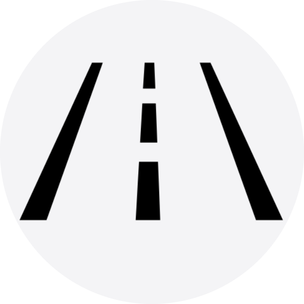
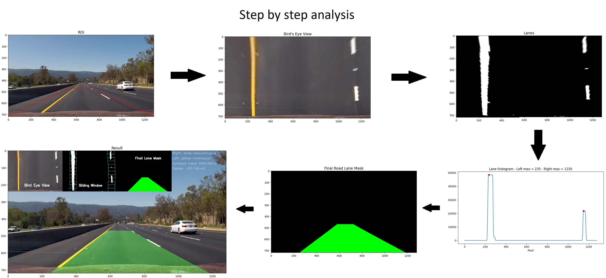

<!-- PROJECT LOGO -->
<br />
<div align="center">
  <a href="https://github.com/nicolassalomon96/CV_projects/tree/main/road_line_detector">
    
  </a>

<h3 align="center">Road Lane Detector for Autonomous Vehicles</h3>

  <p align="center">
    Lane detection system for autonomous vehicles employing different image processing and spatial transformation techniques.
    <br />
    <a href="https://github.com/nicolassalomon96/CV_projects/tree/main/road_line_detector"><strong>Explore the docs »</strong></a>
    <br />
    <br />
    <a href="https://github.com/nicolassalomon96/CV_projects/tree/main/road_line_detector/outputs/output_1.gif">View Demo</a>
    ·
    <a href="https://github.com/nicolassalomon96/CV_projects/tree/main/road_line_detector/issues/new?labels=bug&template=bug-report---.md">Report Bug</a>
    ·
    <a href="https://github.com/nicolassalomon96/CV_projects/tree/main/road_line_detector/issues/new?labels=enhancement&template=feature-request---.md">Request Feature</a>
  </p>
</div>


<!-- TABLE OF CONTENTS -->
<details>
  <summary>Table of Contents</summary>
  <ol>
    <li>
      <a href="#about-the-project">About The Project</a>
      <ul>
        <li><a href="#built-with">Built With</a></li>
      </ul>
    </li>
    <li>
      <a href="#getting-started">Getting Started</a>
      <ul>
        <li><a href="#prerequisites">Prerequisites</a></li>
        <li><a href="#installation">Installation</a></li>
      </ul>
    </li>
    <li><a href="#usage">Usage</a></li>
    <li><a href="#contact">Contact</a></li>
  </ol>
</details>


<!-- ABOUT THE PROJECT -->
## About The Project

![Product Name Screen Shot][product-screenshot]

Lane detection is a crucial task in the development of autonomous driving systems, essential for enhancing road safety and reducing traffic accidents. This project focuses on the use of advanced image processing techniques and spatial transformations to accurately and in real-time identify and track road lanes.

By analyzing images captured by vehicle-mounted cameras, algorithms are applied to detect lane lines, even under challenging conditions. Spatial transformations facilitate the interpretation of road geometry and the vehicle's position relative to the lanes.

The effective implementation of these technologies is a critical step towards realizing fully autonomous vehicles that can navigate safely and efficiently without human intervention. Improved lane detection not only contributes to the safety of drivers and pedestrians but also promotes more orderly traffic flow and congestion reduction, marking a significant advancement in urban mobility and future transportation.

<p align="right">(<a href="#readme-top">back to top</a>)</p>


### Built With

* [![Python][Python]][Python-url]
* [![OpenCV][OpenCV]][OpenCV-url]
* [![NumPy][NumPy]][NumPy-url]

<p align="right">(<a href="#readme-top">back to top</a>)</p>


<!-- GETTING STARTED -->
## Getting Started

This is an example of how you may set up this project locally in your computer.
To get a local copy up and running follow these simple example steps.

### Prerequisites

The following packages may be installed in order to run the code:
* Numpy, OpenCV, Matplotlib, Imageio
  ```sh
  pip install numpy opencv-python matplotlib imageio
  ```

### Installation

1. Clone the repo
   ```sh
   git clone https://github.com/nicolassalomon96/CV_projects/tree/main/road_line_detector
   ```
2. Install required packages listed on Prerequisites

3. Run Road_Lane_Detector.ipynb using your preferred IDE

<p align="right">(<a href="#readme-top">back to top</a>)</p>


<!-- USAGE EXAMPLES -->
## Usage

This project is based on the next workflow:

1. Read the video through OpenCV VideoCapture.

2. Define an especific area where you want to detect the road lane (defined by the red polygon in the original image below).

```sh
  self.roi = np.array([(0, self.height),(540,470),(750,470),(self.width, self.height)], np.int32) #coordinates for the region of interest
```

3. Convert the actual view into Bird Eye's View (BEV) in order to overcome the perpective camera distortion and measure real distances using OpenCv _getPerspectiveTransform()_ and _perspectiveTransform()_ methods.

4. Binarize the image according to a predefined threshold with the purpose of isolate only both white road lanes and yellow ones.

5. Get the positions of the lanes in the image through the pixel histogram, to draw a curve that represents these lanes.

6. Apply a method that allows you to identify the right and left lines of the lanes in each image or frame of a video to then know their position and draw a curve that represents these lines.
This is done through a sliding window algorithm that determines a starting point in the lower area of ​​the image, using the aforementioned histogram, and moving upwards in the image. The first window counts the number of white pixels that are within it. If this quantity exceeds a threshold, the central position of the next window is moved towards the average lateral position of the detected white pixels. If the number of pixels counted does not exceed the threshold, the next window retains the same position. This process continues until the window reaches the upper limit of the image.
In addition, the movement of the windows is used to determine whether the lines are continuous or discontinuous, an extremely important piece of information when driving vehicles, to determine whether it is safe or not to change lanes.

7. Finally, using trigonometric relationships and the positions of the lines of each lane, the radius of curvature and the displacement with respect to the center of the lane are calculated.

<div align="center">
  <a href="https://github.com/nicolassalomon96/CV_projects/tree/main/road_line_detector/images/process.png">
    
  </a>
</div>


<p align="right">(<a href="#readme-top">back to top</a>)</p>


<!-- ROADMAP -->
<!--
## Roadmap

- [ ] Feature 1
- [ ] Feature 2
- [ ] Feature 3
    - [ ] Nested Feature

See the [open issues](https://github.com/github_username/repo_name/issues) for a full list of proposed features (and known issues).

<p align="right">(<a href="#readme-top">back to top</a>)</p>
-->

<!-- CONTRIBUTING -->
<!--
## Contributing

Contributions are what make the open source community such an amazing place to learn, inspire, and create. Any contributions you make are **greatly appreciated**.

If you have a suggestion that would make this better, please fork the repo and create a pull request. You can also simply open an issue with the tag "enhancement".
Don't forget to give the project a star! Thanks again!

1. Fork the Project
2. Create your Feature Branch (`git checkout -b feature/AmazingFeature`)
3. Commit your Changes (`git commit -m 'Add some AmazingFeature'`)
4. Push to the Branch (`git push origin feature/AmazingFeature`)
5. Open a Pull Request

<p align="right">(<a href="#readme-top">back to top</a>)</p>
-->


<!-- LICENSE -->
<!--
## License

Distributed under the MIT License. See `LICENSE.txt` for more information.

<p align="right">(<a href="#readme-top">back to top</a>)</p>
-->


<!-- CONTACT -->
## Contact
Any comment or contribution is welcome and I will be attentive to respond to you :)

Nicolás Salomón - [Linkedin](https://www.linkedin.com/in/nicolassalomon96/) - [Gmail](nicolassalomon96@gmail.com)

Project Link: [https://github.com/nicolassalomon96/CV_projects/tree/main/road_line_detector](https://github.com/nicolassalomon96/CV_projects/tree/main/road_line_detector)

<p align="right">(<a href="#readme-top">back to top</a>)</p>


<!-- MARKDOWN LINKS & IMAGES -->
<!-- https://www.markdownguide.org/basic-syntax/#reference-style-links -->
[product-screenshot]: images/output_frame.png
[Python]: https://img.shields.io/badge/python-3670A0?style=for-the-badge&logo=python&logoColor=ffdd54
[Python-url]: https://www.python.org/
[OpenCV]: https://img.shields.io/badge/OpenCV-27338e?style=for-the-badge&logo=OpenCV&logoColor=white
[OpenCV-url]: https://opencv.org/
[NumPy]: https://img.shields.io/badge/-NumPy-013243?style=flat&logo=numpy&logoColor=white
[NumPy-url]: https://opencv.org/
