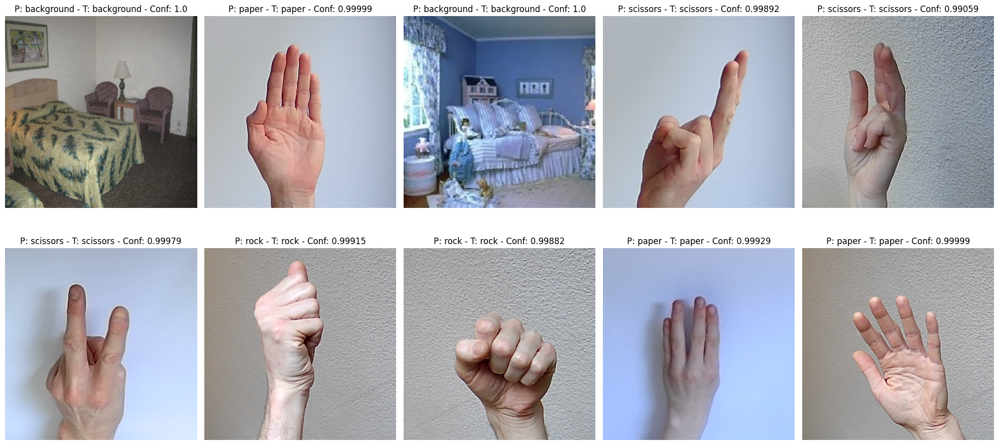

<!-- PROJECT LOGO -->
<br />
<div align="center">
  <a href="https://github.com/nicolassalomon96/CV_projects/tree/main/rock-paper-scissors">
    
  </a>

<h3 align="center">Rock, paper and scissor detection</h3>

  <p align="center">
    A rock, paper and scissor detection using a webcam and Support Vector Machine (SVM) algorithm.
    <br />
    <a href="https://github.com/nicolassalomon96/CV_projects/tree/main/rock-paper-scissors"><strong>Explore the docs »</strong></a>
    <br />
    <br />
    <a href="https://github.com/nicolassalomon96/CV_projects/tree/main/rock-paper-scissors/images/output_gif.gif">View Demo</a>
    ·
    <a href="https://github.com/nicolassalomon96/CV_projects/tree/main/rock-paper-scissors/issues/new?labels=bug&template=bug-report---.md">Report Bug</a>
    ·
    <a href="https://github.com/nicolassalomon96/CV_projects/tree/main/rock-paper-scissors/issues/new?labels=enhancement&template=feature-request---.md">Request Feature</a>
  </p>
</div>


<!-- TABLE OF CONTENTS -->
<details>
  <summary>Table of Contents</summary>
  <ol>
    <li>
      <a href="#about-the-project">About The Project</a>
      <ul>
        <li><a href="#built-with">Built With</a></li>
      </ul>
    </li>
    <li>
      <a href="#getting-started">Getting Started</a>
      <ul>
        <li><a href="#prerequisites">Prerequisites</a></li>
        <li><a href="#installation">Installation</a></li>
      </ul>
    </li>
    <li><a href="#usage">Usage</a></li>
    <li><a href="#contact">Contact</a></li>
  </ol>
</details>


<!-- ABOUT THE PROJECT -->
## About The Project

![Product Name Screen Shot][product-screenshot]

In the realm of artificial intelligence and computer vision, hand gesture recognition represents a fascinating and practical challenge. This project focuses on detecting hand positions corresponding to the popular game "Rock, Paper, Scissors." This game, known for its simplicity and universal nature, serves as an excellent application to demonstrate the capabilities of computer vision and machine learning technologies.

The primary goal of this project is to develop a system that can identify and classify hand positions in real-time as rock, paper, or scissors using advanced image processing and artificial intelligence techniques.

<p align="right">(<a href="#readme-top">back to top</a>)</p>


### Built With

* [![Python][Python]][Python-url]
* [![NumPy][NumPy]][NumPy-url]
* [![Pandas][Pandas]][Pandas-url]
* [![Pytorch][Pytorch]][Pytorch-url]
* [![Scikit-learn][Scikit-learn]][Scikit-learn-url]
* [![OpenCV][OpenCV]][OpenCV-url]


<p align="right">(<a href="#readme-top">back to top</a>)</p>


<!-- GETTING STARTED -->
## Getting Started

This is an example of how you may set up this project locally in your computer.
To get a local copy up and running follow these simple example steps.

### Prerequisites

The following packages may be installed in order to run the code:

* Packages:
  ```sh
  pip install numpy opencv-python matplotlib pillow pandas scikit-learn
  ```
  ```sh
  pip3 install torch torchvision torchaudio --index-url https://download.pytorch.org/whl/cu118 #for examples see https://pytorch.org/get-started/locally/
  ```

### Installation

1. Clone the repo
   ```sh
   git clone https://github.com/nicolassalomon96/CV_projects/tree/main/rock-paper-scissors
   ```
2. Install required packages listed on Prerequisites

<p align="right">(<a href="#readme-top">back to top</a>)</p>


<!-- USAGE EXAMPLES -->
## Usage

**Run main_SVM.ipynb notebook**

The implementation of this project includes the following key stages:

  * Data Collection: Gathering images of hands in different positions (rock, paper, and scissors) to generate a dataset for training a classification model, dividing it into training, validation, and test sets.
  * Image Processing: Implementing a feature extractor for each image using a ResNet-18 neural network to generate representative "tokens" for subsequent training of a classification model.
  * Model Training: Designing and training a classification network based on Support Vector Machines (SVM).
  * Evaluation and Validation: Measuring the model's performance using different metrics: accuracy, precision, recall, and F1-score. The current model achieved an accuracy of 99% on the test dataset.
  * Real-Time Implementation: Integrating the trained model into an application that can process video sequences in real-time and provide instant results.

This project not only demonstrates the technical ability to solve complex problems using computer vision but also offers an interactive and engaging application that can be used in various educational and recreational contexts.


<div align="center">
  <a href="https://github.com/nicolassalomon96/CV_projects/tree/main/rock-paper-scissors">
    
  </a>
</div>

<p align="right">(<a href="#readme-top">back to top</a>)</p>


<!-- ROADMAP -->
<!--
## Roadmap

- [ ] Feature 1
- [ ] Feature 2
- [ ] Feature 3
    - [ ] Nested Feature

See the [open issues](https://github.com/github_username/repo_name/issues) for a full list of proposed features (and known issues).

<p align="right">(<a href="#readme-top">back to top</a>)</p>
-->

<!-- CONTRIBUTING -->
<!--
## Contributing

Contributions are what make the open source community such an amazing place to learn, inspire, and create. Any contributions you make are **greatly appreciated**.

If you have a suggestion that would make this better, please fork the repo and create a pull request. You can also simply open an issue with the tag "enhancement".
Don't forget to give the project a star! Thanks again!

1. Fork the Project
2. Create your Feature Branch (`git checkout -b feature/AmazingFeature`)
3. Commit your Changes (`git commit -m 'Add some AmazingFeature'`)
4. Push to the Branch (`git push origin feature/AmazingFeature`)
5. Open a Pull Request

<p align="right">(<a href="#readme-top">back to top</a>)</p>
-->


<!-- LICENSE -->
<!--
## License

Distributed under the MIT License. See `LICENSE.txt` for more information.

<p align="right">(<a href="#readme-top">back to top</a>)</p>
-->


<!-- CONTACT -->
## Contact
Any comment or contribution is welcome and I will be attentive to respond to you :)

Nicolás Salomón - [Linkedin](https://www.linkedin.com/in/nicolassalomon96/) - [Gmail](nicolassalomon96@gmail.com)

Project Link: [https://github.com/nicolassalomon96/CV_projects/tree/main/rock-paper-scissors](https://github.com/nicolassalomon96/CV_projects/tree/main/rock-paper-scissors)

<p align="right">(<a href="#readme-top">back to top</a>)</p>


<!-- MARKDOWN LINKS & IMAGES -->
<!-- https://www.markdownguide.org/basic-syntax/#reference-style-links -->
[product-screenshot]: images/output_image_2.png
[Python]: https://img.shields.io/badge/python-3670A0?style=for-the-badge&logo=python&logoColor=ffdd54
[Python-url]: https://www.python.org/
[OpenCV]: https://img.shields.io/badge/OpenCV-27338e?style=for-the-badge&logo=OpenCV&logoColor=white
[OpenCV-url]: https://opencv.org/
[NumPy]: https://img.shields.io/badge/-NumPy-013243?style=flat&logo=numpy&logoColor=white
[NumPy-url]: https://opencv.org/
[Pandas]: https://img.shields.io/badge/-pandas-05122A?style=flat&logo=pandas
[Pandas-url]: https://pandas.pydata.org/
[Scikit-learn]: https://img.shields.io/badge/scikit-learn-whitesmoke?style=for-the-badge&logo=scikit-learn
[Scikit-learn-url]: https://scikit-learn.org/
[Pytorch]: https://img.shields.io/badge/PyTorch-black?logo=PyTorch
[Pytorch-url]: https://pytorch.org/