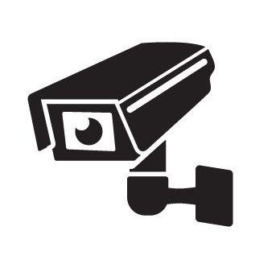

<!-- PROJECT LOGO -->
<br />
<div align="center">
  <a href="https://github.com/nicolassalomon96/CV_projects/blob/main/security_camera_system">
    
  </a>

<h3 align="center">Surveillance Camera System using Computer Vision</h3>

  <p align="center">
    A surveillance camera system that detects people and send an email to advise you.
    <br />
    <a href="https://github.com/nicolassalomon96/CV_projects/blob/main/security_camera_system"><strong>Explore the docs »</strong></a>
    <br />
    <br />
    <a href="https://github.com/nicolassalomon96/CV_projects/blob/main/security_camera_system/images/output_2_gif.gif">View Demo</a>
    ·
    <a href="https://github.com/nicolassalomon96/CV_projects/blob/main/security_camera_system/issues/new?labels=bug&template=bug-report---.md">Report Bug</a>
    ·
    <a href="https://github.com/nicolassalomon96/CV_projects/blob/main/security_camera_system/issues/new?labels=enhancement&template=feature-request---.md">Request Feature</a>
  </p>
</div>


<!-- TABLE OF CONTENTS -->
<details>
  <summary>Table of Contents</summary>
  <ol>
    <li>
      <a href="#about-the-project">About The Project</a>
      <ul>
        <li><a href="#built-with">Built With</a></li>
      </ul>
    </li>
    <li>
      <a href="#getting-started">Getting Started</a>
      <ul>
        <li><a href="#prerequisites">Prerequisites</a></li>
        <li><a href="#installation">Installation</a></li>
      </ul>
    </li>
    <li><a href="#usage">Usage</a></li>
    <li><a href="#contact">Contact</a></li>
  </ol>
</details>


<!-- ABOUT THE PROJECT -->
## About The Project

![Product Name Screen Shot][product-screenshot]

In the era of advanced technology, security has become a critical priority in both residential and commercial environments. The development of intelligent surveillance systems is essential to ensure the protection of properties and people. This project proposes the creation of a person detection system using a camera, which, upon detecting the presence of one or more individuals, sends an email notification to a specific recipient and starts recording the surroundings. This system combines computer vision technology with real-time communication, offering an effective and modern solution for surveillance and security.

### Relevance and Advantages of the System

1. **Rapid Response:** By immediately notifying recipients, the system allows for a quick reaction to the presence of unauthorized individuals, potentially preventing crimes.
2. **Remote Monitoring:** The ability to receive notifications anywhere via email facilitates continuous and effective monitoring without the need to be physically present.
3. **Automation:** Automating detection and notification reduces the need for constant human intervention, increasing efficiency and lowering operational costs.
4. **Scalability:** The system can integrate with multiple cameras and expand to cover large areas, making it suitable for both small properties and large installations.
5. **Visual Documentation:** The captured images provide visual evidence that can be useful for subsequent investigations or to provide proof to authorities.

<p align="right">(<a href="#readme-top">back to top</a>)</p>


### Built With

* [![Python][Python]][Python-url]
* [![OpenCV][OpenCV]][OpenCV-url]
* [![Pytorch][Pytorch]][Pytorch-url]
* [![Ultralytics][Ultralytics]][Ultralytics-url]

<p align="right">(<a href="#readme-top">back to top</a>)</p>


<!-- GETTING STARTED -->
## Getting Started

This is an example of how you may set up this project locally in your computer.
To get a local copy up and running follow these simple example steps.

### Prerequisites

The following packages may be installed in order to run the code:

* OpenCV
  ```sh
  pip install opencv-python
  ```
* Ultralytics (for YOLOv8)
  ```sh
  pip install ultralytics
  ```
* Pytorch: according to your computer, see https://pytorch.org/get-started/locally/
  ```sh
  pip3 install torch torchvision torchaudio --index-url https://download.pytorch.org/whl/cu118 #for example
  ```
* Keyboard
  ```sh
  pip install keyboard
  ```

### Installation

1. Clone the repo
   ```sh
   git clone https://github.com/nicolassalomon96/CV_projects/blob/main/security_camera_system
   ```
2. Install required packages listed on Prerequisites

<p align="right">(<a href="#readme-top">back to top</a>)</p>


<!-- USAGE EXAMPLES -->
## Usage

In order to probe or use this project you must create a _email_settings.py_ file using _email_settings_example.py_ as an example. Open: https://myaccount.google.com/apppasswords, generate an App name and copy the generated password and complete variables on _email_settings_example.py_.

This project is based on 3 main components:

  1. Surveillance Camera: A high resolution camera installed in the area of ​​interest.
  2. People Detection Software: Computer vision and machine learning algorithms that process images in real time to identify the presence of people.
  3. Notification Server: A module that sends emails with details of the detection.

After you install all the requirements and create the _email_settings.py_ file, you should specify the camera input on line 89 of _main.py_ ('0' for webcam source or specify an specific path to video):
```sh
  cap = cv2.VideoCapture(0) # or "path/to/video/file.mp4"
```

Finally run _main.py_:
```sh
  python main.py
```

<p align="right">(<a href="#readme-top">back to top</a>)</p>


<!-- ROADMAP -->
<!--
## Roadmap

- [ ] Feature 1
- [ ] Feature 2
- [ ] Feature 3
    - [ ] Nested Feature

See the [open issues](https://github.com/github_username/repo_name/issues) for a full list of proposed features (and known issues).

<p align="right">(<a href="#readme-top">back to top</a>)</p>
-->

<!-- CONTRIBUTING -->
<!--
## Contributing

Contributions are what make the open source community such an amazing place to learn, inspire, and create. Any contributions you make are **greatly appreciated**.

If you have a suggestion that would make this better, please fork the repo and create a pull request. You can also simply open an issue with the tag "enhancement".
Don't forget to give the project a star! Thanks again!

1. Fork the Project
2. Create your Feature Branch (`git checkout -b feature/AmazingFeature`)
3. Commit your Changes (`git commit -m 'Add some AmazingFeature'`)
4. Push to the Branch (`git push origin feature/AmazingFeature`)
5. Open a Pull Request

<p align="right">(<a href="#readme-top">back to top</a>)</p>
-->


<!-- LICENSE -->
<!--
## License

Distributed under the MIT License. See `LICENSE.txt` for more information.

<p align="right">(<a href="#readme-top">back to top</a>)</p>
-->


<!-- CONTACT -->
## Contact
Any comment or contribution is welcome and I will be attentive to respond to you :)

Nicolás Salomón - [Linkedin](https://www.linkedin.com/in/nicolassalomon96/) - [Gmail](nicolassalomon96@gmail.com)

Project Link: [https://github.com/nicolassalomon96/CV_projects/blob/main/security_camera_system](https://github.com/nicolassalomon96/CV_projects/blob/main/security_camera_system)

<p align="right">(<a href="#readme-top">back to top</a>)</p>


<!-- MARKDOWN LINKS & IMAGES -->
<!-- https://www.markdownguide.org/basic-syntax/#reference-style-links -->
[product-screenshot]: images/output_1.png
[Python]: https://img.shields.io/badge/python-3670A0?style=for-the-badge&logo=python&logoColor=ffdd54
[Python-url]: https://www.python.org/
[OpenCV]: https://img.shields.io/badge/OpenCV-27338e?style=for-the-badge&logo=OpenCV&logoColor=white
[OpenCV-url]: https://opencv.org/
[Pytorch]: https://img.shields.io/badge/PyTorch-black?logo=PyTorch
[Pytorch-url]: https://pytorch.org/
[Ultralytics]: https://img.shields.io/badge/ultralytics-v8.1.0-blue
[Ultralytics-url]: https://docs.ultralytics.com/