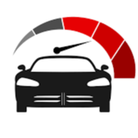
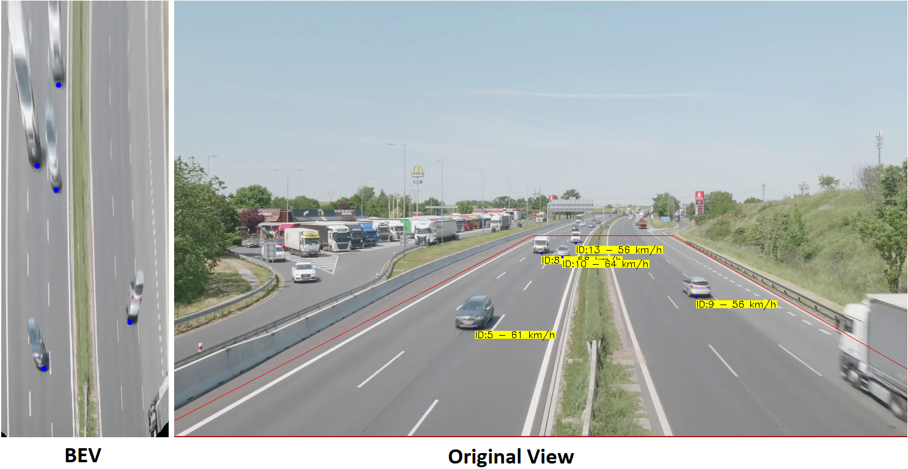

<!-- PROJECT LOGO -->
<br />
<div align="center">
  <a href="https://github.com/nicolassalomon96/CV_projects/tree/main/vehicle_speed_estimation">
    
  </a>

<h3 align="center">Vehicle Speed Estimation through Computer Vision</h3>

  <p align="center">
    An awesome vehicle speed estimation using a highway camera and Ultralytics-YOLOv8 combined with image processing techniques
    <br />
    <a href="https://github.com/nicolassalomon96/CV_projects/blob/main/vehicle_speed_estimation"><strong>Explore the docs »</strong></a>
    <br />
    <br />
    <a href="https://github.com/nicolassalomon96/CV_projects/blob/main/vehicle_speed_estimation/images/output_gif.gif">View Demo</a>
    ·
    <a href="https://github.com/nicolassalomon96/CV_projects/tree/main/vehicle_speed_estimation/issues/new?labels=bug&template=bug-report---.md">Report Bug</a>
    ·
    <a href="https://github.com/nicolassalomon96/CV_projects/tree/main/vehicle_speed_estimation/issues/new?labels=enhancement&template=feature-request---.md">Request Feature</a>
  </p>
</div>


<!-- TABLE OF CONTENTS -->
<details>
  <summary>Table of Contents</summary>
  <ol>
    <li>
      <a href="#about-the-project">About The Project</a>
      <ul>
        <li><a href="#built-with">Built With</a></li>
      </ul>
    </li>
    <li>
      <a href="#getting-started">Getting Started</a>
      <ul>
        <li><a href="#prerequisites">Prerequisites</a></li>
        <li><a href="#installation">Installation</a></li>
      </ul>
    </li>
    <li><a href="#usage">Usage</a></li>
    <li><a href="#contact">Contact</a></li>
  </ol>
</details>


<!-- ABOUT THE PROJECT -->
## About The Project

![Product Name Screen Shot][product-screenshot]

This project leverages computer vision technology to measure vehicle speeds on highways, providing accurate and real-time data. By utilizing high-resolution cameras and advanced image processing algorithms, the system can detect, track, and calculate vehicle speeds autonomously. This enhances road safety by enabling quick responses to incidents and integrates seamlessly with smart traffic infrastructures, offering a cost-effective and efficient solution for traffic monitoring and management.

<p align="right">(<a href="#readme-top">back to top</a>)</p>


### Built With

* [![Python][Python]][Python-url]
* [![OpenCV][OpenCV]][OpenCV-url]
* [![NumPy][NumPy]][NumPy-url]
* [![Ultralytics][Ultralytics]][Ultralytics-url]

<p align="right">(<a href="#readme-top">back to top</a>)</p>


<!-- GETTING STARTED -->
## Getting Started

This is an example of how you may set up this project locally in your computer.
To get a local copy up and running follow these simple example steps.

### Prerequisites

The following packages may be installed in order to run the code:
* Numpy
  ```sh
  pip install numpy
  ```
* OpenCV
  ```sh
  pip install opencv-python
  ```
* Ultralytics (for YOLOv8)
  ```sh
  pip install ultralytics
  ```

### Installation

1. Clone the repo
   ```sh
   git clone https://github.com/nicolassalomon96/CV_projects/tree/main/vehicle_speed_estimation
   ```
2. Install required packages listed on Prerequisites

3. Run main.ipynb using your preferred IDE

<p align="right">(<a href="#readme-top">back to top</a>)</p>


<!-- USAGE EXAMPLES -->
## Usage

This project is based on the next workflow:

1. Read the video through OpenCV VideoCapture.

2. Define an especific area where you want to track and measure vehicle speed (defined by the red polygon in the original image below). Here I searched for the lenght of the white line across the road (about 3m and 6m among they) in Praga, where the video comes from. This is made in order to have the relation between pixels in the video and real distances.

```sh
  vertexes = np.array([[587, 391], [818, 391], [1395, 719], [-50, 719]])
```

3. Convert the actual view into Bird Eye's View (BEV) in order to overcome the perpective camera distortion and measure real distances using OpenCv _getPerspectiveTransform()_ and _perspectiveTransform()_ methods. Here is an example of BEV:
<div align="center">
  <a href="https://github.com/nicolassalomon96/CV_projects/tree/main/vehicle_speed_estimation/images/BEV_vs_Original.png">
    
  </a>
</div>


<p align="right">(<a href="#readme-top">back to top</a>)</p>


<!-- ROADMAP -->
<!--
## Roadmap

- [ ] Feature 1
- [ ] Feature 2
- [ ] Feature 3
    - [ ] Nested Feature

See the [open issues](https://github.com/github_username/repo_name/issues) for a full list of proposed features (and known issues).

<p align="right">(<a href="#readme-top">back to top</a>)</p>
-->

<!-- CONTRIBUTING -->
<!--
## Contributing

Contributions are what make the open source community such an amazing place to learn, inspire, and create. Any contributions you make are **greatly appreciated**.

If you have a suggestion that would make this better, please fork the repo and create a pull request. You can also simply open an issue with the tag "enhancement".
Don't forget to give the project a star! Thanks again!

1. Fork the Project
2. Create your Feature Branch (`git checkout -b feature/AmazingFeature`)
3. Commit your Changes (`git commit -m 'Add some AmazingFeature'`)
4. Push to the Branch (`git push origin feature/AmazingFeature`)
5. Open a Pull Request

<p align="right">(<a href="#readme-top">back to top</a>)</p>
-->


<!-- LICENSE -->
<!--
## License

Distributed under the MIT License. See `LICENSE.txt` for more information.

<p align="right">(<a href="#readme-top">back to top</a>)</p>
-->


<!-- CONTACT -->
## Contact
Any comment or contribution is welcome and I will be attentive to respond to you :)

Nicolás Salomón - [Linkedin](https://www.linkedin.com/in/nicolassalomon96/) - [Gmail](nicolassalomon96@gmail.com)

Project Link: [https://github.com/nicolassalomon96/CV_projects/tree/main/vehicle_speed_estimation](https://github.com/nicolassalomon96/CV_projects/tree/main/vehicle_speed_estimation)

<p align="right">(<a href="#readme-top">back to top</a>)</p>


<!-- MARKDOWN LINKS & IMAGES -->
<!-- https://www.markdownguide.org/basic-syntax/#reference-style-links -->
[product-screenshot]: images/screenshot.png
[Python]: https://img.shields.io/badge/python-3670A0?style=for-the-badge&logo=python&logoColor=ffdd54
[Python-url]: https://www.python.org/
[OpenCV]: https://img.shields.io/badge/OpenCV-27338e?style=for-the-badge&logo=OpenCV&logoColor=white
[OpenCV-url]: https://opencv.org/
[NumPy]: https://img.shields.io/badge/-NumPy-013243?style=flat&logo=numpy&logoColor=white
[NumPy-url]: https://opencv.org/
[Ultralytics]: https://img.shields.io/badge/ultralytics-v8.1.0-blue
[Ultralytics-url]: https://docs.ultralytics.com/